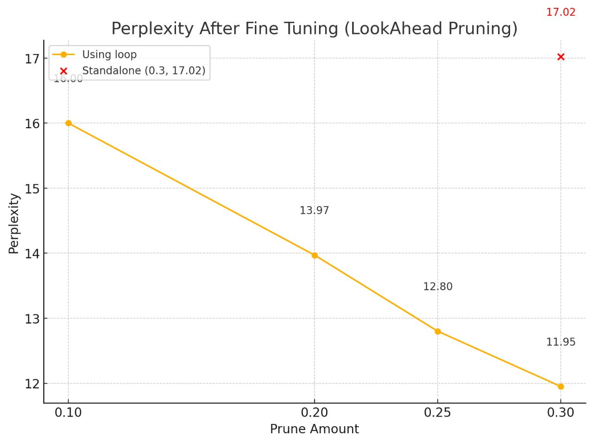

# Global Lookahead Pruning for Transformer-Based Language Models

## Overview

Global Lookahead Pruning is an activation-aware post-training pruning method for transformer-based language models. The method estimates weight importance by combining weight magnitude with lookahead activation differences between subsequent transformer layers.

The goal is to reduce model size while preserving language modeling performance, measured using perplexity and sparsity.

## Key Features

- Post-training pruning for transformer language models
- Activation-aware importance scoring
- Global pruning across model layers
- Baseline comparison with magnitude-based pruning
- Perplexity and sparsity evaluation on WikiText-2
- Fine-tuning support for pruned models

## Method

For a weight matrix in layer `L`, Global Lookahead Pruning calculates an importance score using:

```text
importance = |weight| × sqrt(|mean(A_L+1) - mean(A_L+2)|)
```
## Repository Structure

src/        Reusable implementation

scripts/    Command-line experiment runners

notebooks/  Original exploratory experiments

results/    Tables and figures

reports/    Full project report

docs/       Additional documentation

## Installation
```text
git clone https://github.com/YOUR_USERNAME/global-lookahead-pruning.git
cd global-lookahead-pruning
python -m venv .venv
.venv\Scripts\activate
pip install -r requirements.txt
```

## Usage
```text
python scripts/run_lookahead_pruning.py --model gpt2 --sparsity 0.3
```

## Experimental Setup

- Models: GPT-2, Qwen-2.5B, DeepSeekR1
- Dataset: WikiText-2
- Metrics: Perplexity and sparsity
- Baselines:
-- Global magnitude pruning
-- Layerwise magnitude pruning

## Results

| Model      |            Method | Perplexity | Sparsity |
| ---------- | ----------------: | ---------: | -------: |
| Qwen-2.5B  |          Baseline |      17.62 |    0.000 |
| Qwen-2.5B  | Layerwise Pruning |      30.51 |    0.299 |
| Qwen-2.5B  | Lookahead Pruning |      22.60 |    0.145 |
| GPT-2      |          Baseline |      45.73 |    0.000 |
| GPT-2      | Layerwise Pruning |      62.58 |    0.299 |
| GPT-2      | Lookahead Pruning |      63.01 |    0.087 |
| DeepSeekR1 |          Baseline |      68.58 |    0.000 |
| DeepSeekR1 | Layerwise Pruning |      82.84 |    0.261 |
| DeepSeekR1 | Lookahead Pruning |      90.20 |    0.145 |

## Visual Results

### Fine-Tuning Curve



### Sparsity Comparison


### Perplexity Comparison


## Fine-Tuning Observation

Iterative Lookahead pruning with fine-tuning reached around 30% sparsity with validation perplexity close to 11.95 on GPT-2 in the reported experiments.

## Limitations

- The current implementation focuses mainly on unstructured pruning.
- Hardware speedup is not guaranteed unless sparse kernels or structured sparsity are used.
- Activation mean differences may not fully capture importance for every architecture.
- Results depend on calibration data quality.

## Future Work

- Add structured N:M pruning support
- Test on larger LLMs
- Combine pruning with quantization
- Add support for more transformer architectures
- Improve activation statistics using variance or norm-based metrics
